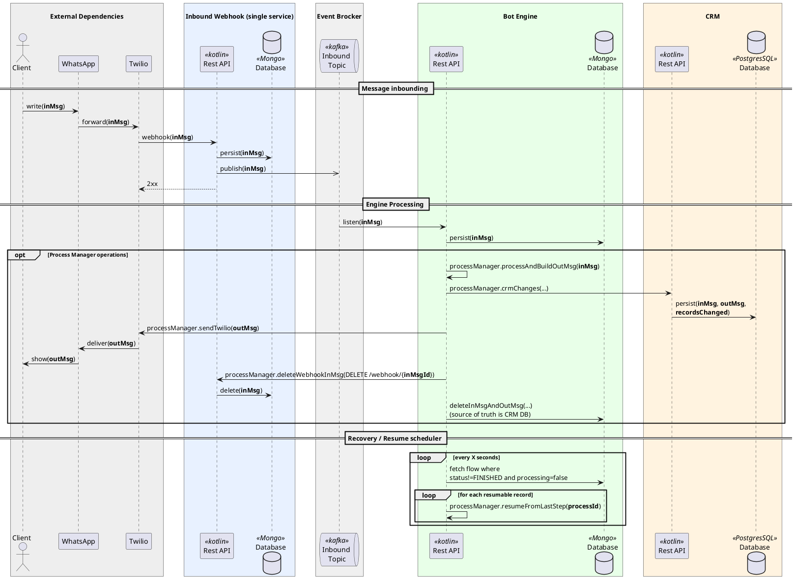
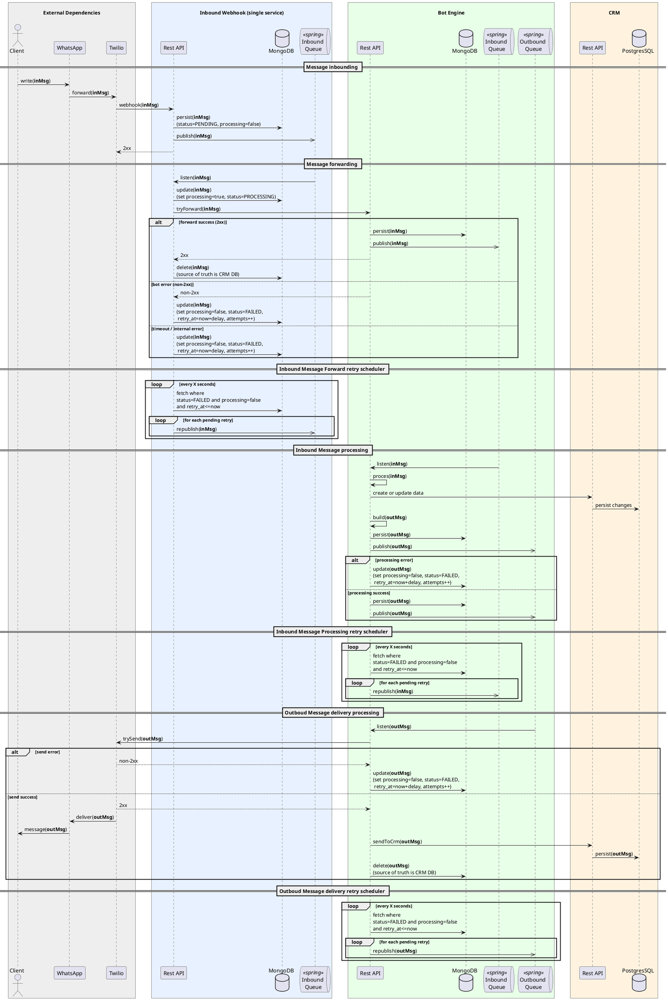

# Arquitetura

### Componentes
- **Webhook:** Serviço responsável por receber mensagens do WhatsApp via Twilio e persistir e encaminhar para o bot engine. Ele foi pensado para fazer apenas esta tarefa simples para reduzir riscos de falhas na entrada das mensagens no sistema.
- **Bot Engine:** Serviço principal que processa as mensagens recebidas, aplica a lógica de negócio, interage com o CRM e gera respostas.
- **CRM:** Sistema de gerenciamento de relacionamento com o cliente, utilizado para armazenar e gerenciar dados dos clientes e interações.

### Diagrama do Fluxo Principal
![Fluxo Principal](https://img.plantuml.biz/plantuml/svg/ZLPTRzem57sFbFzmnrwej7viUwagG2qbqP3AnjfAtGClJd81Ys1djbEOflttNTi916WHy43id7lFkTV7DhVQC6NAPGvX40PwmKN155j2Nwx7BCkucC6Ng-QBCS5voWicJ1CG1ebSGsiYehL19LWE0onGP2XIZdeYMl0nSfym062faGhkSux20DEGkYVxfjXcXzRBd1bzLnGjYrdP0IkA0zJpYkTSEennZs50l41o6gg68f4bpRvWCfTo0MrDmdC4ZUgLftZc1Lx7d-FuWE0HjO6xyT3By0dk2WwTpaAQd8jUpuPapB24QOJMe7fguYt_Uf1Gp4YAcRGXXoAZLzkFlfBf0fLJ55_Phqt_kyIISjTrJCIpB7ZgABYVSnDM59iksDi4VMaW4ZCkiAutZgwFrvj8StAjX3sfpll7aQykZhz6LyVvKxKycP-mZdeijPafr4y_7_O4TBimGgtP3EkkMVzsks7WBGZdlOtHu0PMYXjiTv8U5oCzwrmclJFQ9Xi0WRtZ23gLQiLKjWiEW-gzJRirpaqzs4TJxYrg6rCtzGOAL9fhin-t4zNRDGG5bKdEzVnOKBEIB-kwLTugC2P3KjFgJjMEED_d8HA3Of-cWXD3mnxlLX86iZ0r8uoOeALI80dD39T2szNVoUZxMVY02dzH3Uz4rYzvdlqe3J4SKZLJLJuxI4NpztCcPgZR5nSNPpQeWlgWTulv13IIZjaF9u8c5APIPTgdpDvKibc8FIMQVEpFklPEPgUfuREjVJFC-IkgD-1D2rVElm4zbwi3xAws7HFlwICsDFXIMzPsV10zHCyHN5PXbt_h1WrTwV-ybkEMzscFBzwEito04q06gDRUhjr4jBKiLOeWfs1KQUR0DT1X18F-cJicAjy_qY9Ht_x09JtgSadNH3h7hCp9YdO7v58MW0xnYswGL8hiq9XRGLCqwHockLnHtr7HsKjthYdrXsuy_3vy-XODWD4HLMosMNVASeqsesEYemMGKGfbnR24hYrl8uiuPJkuE8oLN3umRPuC5hQT5MYORLpXEb2ruPP-wLz16Fm7)

  
Código do diagrama

Você poderá editar o código abaixo no site [https://editor.plantuml.com](https://editor.plantuml.com).

### Legenda do Diagrama

- **inMsg** — mensagem de entrada (*inbound message*).
- **outMsg** — mensagem de saída (*outbound message*).
- **processing=false** — mensagem livre para reprocessamento.
- **publish / republish** — envio inicial / reenvio para fila.
- **2xx / non-2xx** — resposta de sucesso / erro HTTP.
- **source of truth** — banco responsável pelo dado final.

### Diagrama do Process Flow (Bot Engine)
![Fluxo Principal](https://img.plantuml.biz/plantuml/svg/rLTTRnCx47sFbFym2Y-fsWekzmMX9A9jagj854ABn7s8XBoRQMAniVVQNbB-_HtRkrdl9qL28Dg79lRn-9pncR7xHXkcJ7P8O3WO3lGNBbAcs06kvUEQRRTSxE3bYt1YJN0UyvG94mBiRoGVORGHYqU3Ih04vfYYsAA8EUgD6C6pXViP3W1ORAI2cuIZCC0qnEwJdKdB-33wj6T6NwNfo6AEzWjBqmRguv4dN3gCSH-70zeNY4x0QYKYcT7e9upsKdw1iIRg2O96zPN7UEO9lbh-jLmsDhX3RU1glV8qV82hb5lSbXaMCOqmkfLY9-VN8MOUMSX_6MOqNn3OY0zsmE6u7tC3C9deL16fsQoD_xKqi10xBh1WkboywcSQITFBakQ_ov0mgowIfuNlCzDSAVF1fuYxkRjrgfRBvT-B5_sgOdLeg5fBRNOAzVs7jmN6AWiscaxX5hLcEooIRfqxdGu7tdfmEJiP35x3KN63uqaqu-9MxoRFezdPS72Q9wmt6Y4Vf3eojQrZytaRzUGN6zT_gQCfTeagrymZMfAYqboRwfAD65FXcanFrujtyzMxVouWLJ8cXIHh-i0IZMUreBEgsoXm5YLSxnigWqMXq9UFzKJcqej41Widb_NDQ2U3ec-lgkeifTF5fcWqeL2ZCho08XDtxsyMz_UKZ9QC-bgWm4PzMxOVsN304bE80ft5TXSOa-upwxOyWe_LVJ8LwAnHFvrfBrVLFUCI3z2Tgoqcs9OhcQaOGJwGvipiWMkWEeFvjTEAP16x9Q1Ir8h7GehBkjGwanpJp-Pf9-SiUZgwvTNgxM9-iH6Wa0xeCpDJ8O_d98nzkm1c31vIey_FI-Q67v0w33mde-NNZHFoMxbHlybBf6YbHQdablCXGCTxt6O9AbStYPGfu5UaYN_fEegbsEf-6GzeuZsrArHq6LHe0gDDwr8smeuMx2UMletlzYMx0pAAPgzgMyaEPgTh11hjGs6darqUkfDHydFwSxTHpsWMItlRg9IYjwQFsGtqjmO1OuLa0I3PtWpk5g5RmCzxP5ZT4E-PsA4xaTQTeumdhfUG7Jierhj5Et9Mkp8hhQAon7Ug88qdwpUtBIqVXFYPdhVL6539--PtEsP5KALbFZKBtGPRbtH-fE2QV7zHeVNU5nrr1Ys5vjzXPHxelBYJsLbnzLoNzTRXvjDpWCZVqyurA1JcrFRjTR9byHeAwoQuJ7wzQtFVEfQ1OzjuvXo31rtvJCmJtEBdyAsOlp1Vmy6VIv_zoqPbkNsKD-hGJB4x-ywErHk-I73vPgWbkEVHy0IZ_MdbLlT_fTXgIGoBxGtzfN-Q_mS0)

  
Código do diagrama

Você poderá editar o código abaixo no site [https://editor.plantuml.com](https://editor.plantuml.com).

### Legenda do Diagrama

- **inMsg** — mensagem de entrada (*inbound message*).
- **outMsg** — mensagem de saída (*outbound message*).
- **PENDING** — registrada e aguardando processamento.
- **PROCESSING** — em processamento ativo.
- **FAILED** — falha ocorrida; elegível para retry.
- **processing=false** — mensagem livre para reprocessamento.
- **retry_at** — instante mínimo para nova tentativa.
- **attempts** — contador de tentativas realizadas.
- **publish / republish** — envio inicial / reenvio para fila.
- **2xx / non-2xx** — resposta de sucesso / erro HTTP.
- **source of truth** — banco responsável pelo dado final.

