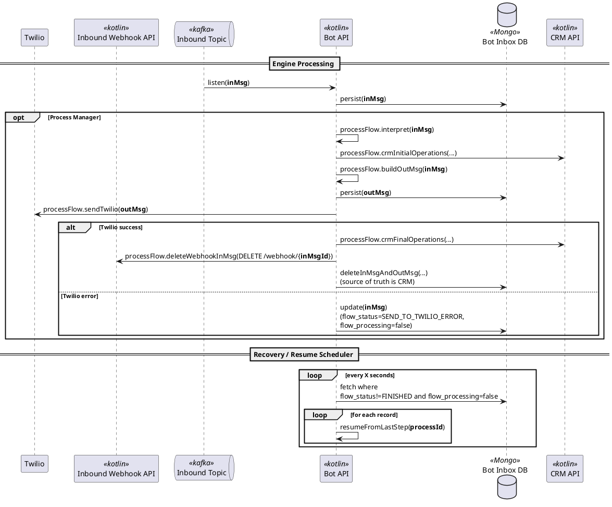

# WhatsApp CRM Bot Platform

## Stack

- Kotlin
- Spring Boot
- MongoDB
- PostgreSQL
- Kafka
- Twilio API
- WhatsApp Business API

## Arquitetura

O sistema segue **Arquitetura Hexagonal com DDD (Domain-Driven Design)**, com separação clara entre:

- domínio de negócio
- casos de uso
- infraestrutura e integrações externas

Essa abordagem reduz acoplamento, melhora testabilidade e facilita evolução do sistema.

## Componentes

### Webhook

Responsável por:

- receber mensagens do WhatsApp via **Twilio**
- persistir a mensagem recebida
- publicar o evento para processamento

Foi projetado para executar **uma responsabilidade simples e crítica**, reduzindo o risco de perda de mensagens na entrada do sistema.

### Bot Engine

Serviço principal que:

- consome mensagens da fila
- processa a lógica do bot
- interage com o CRM
- gera respostas para o usuário
- executa retry e recuperação de fluxo

### CRM

Responsável por:

- persistência definitiva das interações
- gerenciamento de clientes
- histórico de conversas
- atualização de dados de negócio

O **CRM é a source of truth** dos dados finais.

## Fluxo Principal

![Fluxo Principal](https://img.plantuml.biz/plantuml/svg/fLPHZzeu47v7uZ_CSIyWNNVtUgfKhHRKPKdka9OjjxlNxGDIvIG3M0GxPpiBfwh_lMCxWP10YtJmWEryC_Dvvfi97xHXokJhjDtIAouofjWQXd8xPKd2nGBUNbKVJ0dBOvunOQg0TYkIM-ZCHB0rg0HBOOGPYWH5p57FH0T-3TodtG9WiP4AxbAEmW3J4BkLVPBjlKFdPScClisoZiLix8PbMGFrlE4fbmvZtBBTehX0T2ginYAIEPs-OBIKSWLTJSHJ18tgbSVOymJVXx-7OIF08se3jzEnf-4Tt6OSRcvMqgHS30RM9666HKmZT4R5gegtyRUZY6mcKYoaDMcI35vjFePAnYjKZb5uPR_M_RyvvkIxlCTCFCkCnou4zsVkm99YynKx7c0e3GHYmGMMzms3zp--RoJDsNSbx5dtl7kS-Dk5uH_1rO_ZnsfzTdp2kj1JgSr2eNxw-xv6eD-72MhD5bXcpUgtts-tl0JXpM0dDBY6ZU86kpVHW8k9NjnSHeDUkxLxJbWlE4BEfTembTInnNFhTQ-Rwt9JHvFlFMflK-Rq6Z9KccjpQ3SJNMfWa-l-D7WOZH_-_19y2XwUUpLlWqETaBCyIhbUDfmPlaQPc_uxNNVH99HdL0eynSVn-3BzPtW_Vleh6DNSLTFtTbkMfspGHupbAwh_OEffeeAdU8b9djBA5YoLCWDqa7VKnh4KYRRQ-0dZEPfuIJL6HSr_96tMXNDD5GLaX1NKD4MkC055aLHYKRLGv-NtYE7_poe0ITpfl4YYxt6OqYGXjPSIBrlvJPqfqJGewaGBE16izFK93TguCZDbH9WmGJscG1AQ6Iw5Ays1Hzy9cJSey1V5zbOamvodoSVSK8Hc1lUEYl7GS4JdTqic5gYx5nSNpgY0UgEJL_aDQ2TTNB-T2JhmLTVUPNA4nqx9DHwQYk9VKDq3lywyCXtsCoV1b9EgZy2hWwSOLzUWbtBJm1voEnWzDNuK3Gs-b0gqsHu5zy5p09U5sUNNCZrZT_5llJEwpBjjQgIcWRg18q35B-fkAsTrBtCL8yWv69MR9N0Dz0Q1qR1NrVnkO5pIKkThQkzJy-9pTLwS8EJdn3oL6pyiPiAtto_zSFpW6WyOlLUoNOlrvopLs1mVof9X4VtNg8wEdxU2iyDGoVKzq-R9O6RJMO36UmrMM_y3_Rh_STy1)

<details>
  <summary>Código do diagrama</summary>

Você pode editar este código em https://editor.plantuml.com


</details>

## Fluxo de Processamento do Bot


<details>
  <summary>Código do diagrama</summary>

Você pode editar este código em https://editor.plantuml.com


</details>

## Legenda

- **inMsg**: mensagem de entrada
- **outMsg**: mensagem de saída
- **PENDING**: registrada e aguardando processamento
- **PROCESSING**: em processamento ativo
- **FAILED**: falha ocorrida; elegível para retry
- **processing=false**: mensagem livre para reprocessamento
- **retry_at**: instante mínimo para nova tentativa
- **attempts**: contador de tentativas realizadas
- **publish / republish**: envio inicial / reenvio para fila
- **2xx / non-2xx**: resposta de sucesso / erro HTTP
- **source of truth**: banco responsável pelo dado final

## Estrutura do Projeto

```text
sales
├── domain
│   ├── model
│   ├── repository
│   ├── service
│   ├── event
│   ├── exception
│   ├── specification
│   └── valueobject
│
├── application
│   ├── usecase
│   ├── port
│   │   ├── input
│   │   └── output
│   ├── command
│   ├── query
│   ├── dto
│   ├── mapper
│   └── service
│
└── infrastructure
    ├── web
    │   ├── controller
    │   ├── request
    │   ├── response
    │   └── mapper
    ├── persistence
    │   ├── entity
    │   ├── repository
    │   ├── mapper
    │   └── specification
    ├── messaging
    │   ├── producer
    │   ├── consumer
    │   └── mapper
    ├── client
    │   ├── http
    │   ├── grpc
    │   └── mapper
    ├── scheduler
    └── config
```

## Como rodar e acessar

Pré-requisitos

- Java 25
- Docker & Docker Compose
- (Opcional) Gradle wrapper já incluído

Passos mínimos

1) Subir o banco (no diretório `infra-crm`):

```powershell
cd infra-crm
docker compose up -d
```

2) Rodar a aplicação (na raiz do projeto):

```powershell
cd ..
.\gradlew.bat bootRun
```

URLs úteis

- Swagger UI: http://localhost:8080/swagger-ui/index.html
- OpenAPI JSON: http://localhost:8080/v3/api-docs
- Health: GET http://localhost:8080/health/live  → {"status":"UP"}

Pronto — apenas isso é necessário para subir a aplicação e acessar a documentação.
