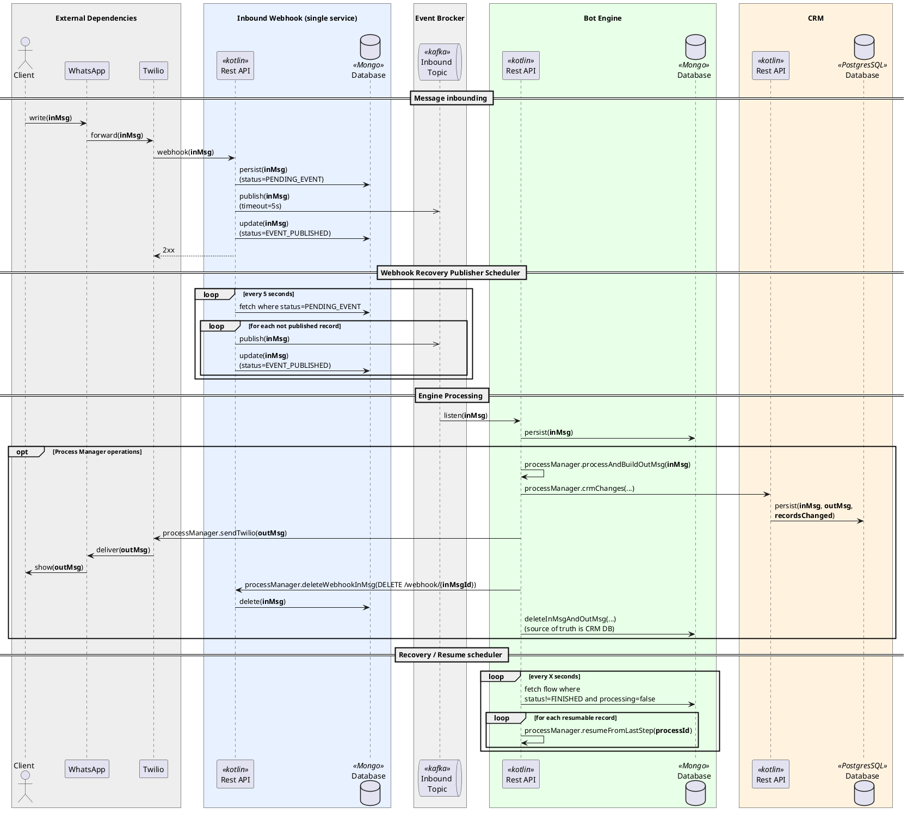
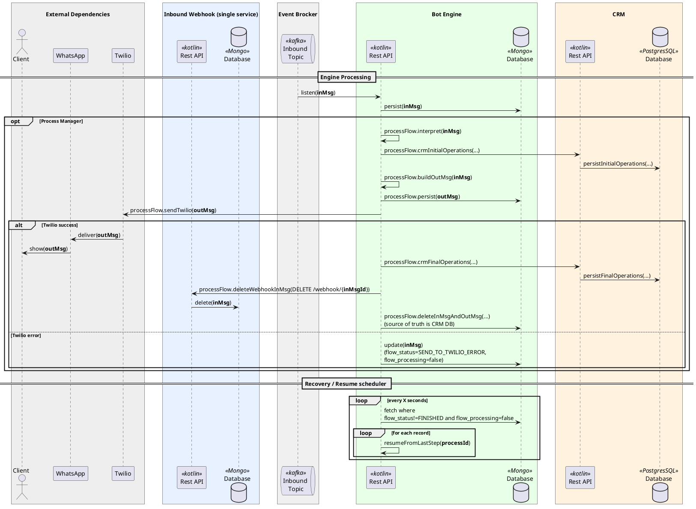

# Arquitetura

### Componentes
- **Webhook:** Serviço responsável por receber mensagens do WhatsApp via Twilio e persistir e encaminhar para o bot engine. Ele foi pensado para fazer apenas esta tarefa simples para reduzir riscos de falhas na entrada das mensagens no sistema.
- **Bot Engine:** Serviço principal que processa as mensagens recebidas, aplica a lógica de negócio, interage com o CRM e gera respostas.
- **CRM:** Sistema de gerenciamento de relacionamento com o cliente, utilizado para armazenar e gerenciar dados dos clientes e interações.

---

### Diagrama do Fluxo Principal
![Fluxo Principal](https://img.plantuml.biz/plantuml/svg/fLPHZzeu47v7uZ_CSIyWNNVtUgfKhHRKPKdka9OjjxlNxGDIvIG3M0GxPpiBfwh_lMCxWP10YtJmWEryC_Dvvfi97xHXokJhjDtIAouofjWQXd8xPKd2nGBUNbKVJ0dBOvunOQg0TYkIM-ZCHB0rg0HBOOGPYWH5p57FH0T-3TodtG9WiP4AxbAEmW3J4BkLVPBjlKFdPScClisoZiLix8PbMGFrlE4fbmvZtBBTehX0T2ginYAIEPs-OBIKSWLTJSHJ18tgbSVOymJVXx-7OIF08se3jzEnf-4Tt6OSRcvMqgHS30RM9666HKmZT4R5gegtyRUZY6mcKYoaDMcI35vjFePAnYjKZb5uPR_M_RyvvkIxlCTCFCkCnou4zsVkm99YynKx7c0e3GHYmGMMzms3zp--RoJDsNSbx5dtl7kS-Dk5uH_1rO_ZnsfzTdp2kj1JgSr2eNxw-xv6eD-72MhD5bXcpUgtts-tl0JXpM0dDBY6ZU86kpVHW8k9NjnSHeDUkxLxJbWlE4BEfTembTInnNFhTQ-Rwt9JHvFlFMflK-Rq6Z9KccjpQ3SJNMfWa-l-D7WOZH_-_19y2XwUUpLlWqETaBCyIhbUDfmPlaQPc_uxNNVH99HdL0eynSVn-3BzPtW_Vleh6DNSLTFtTbkMfspGHupbAwh_OEffeeAdU8b9djBA5YoLCWDqa7VKnh4KYRRQ-0dZEPfuIJL6HSr_96tMXNDD5GLaX1NKD4MkC055aLHYKRLGv-NtYE7_poe0ITpfl4YYxt6OqYGXjPSIBrlvJPqfqJGewaGBE16izFK93TguCZDbH9WmGJscG1AQ6Iw5Ays1Hzy9cJSey1V5zbOamvodoSVSK8Hc1lUEYl7GS4JdTqic5gYx5nSNpgY0UgEJL_aDQ2TTNB-T2JhmLTVUPNA4nqx9DHwQYk9VKDq3lywyCXtsCoV1b9EgZy2hWwSOLzUWbtBJm1voEnWzDNuK3Gs-b0gqsHu5zy5p09U5sUNNCZrZT_5llJEwpBjjQgIcWRg18q35B-fkAsTrBtCL8yWv69MR9N0Dz0Q1qR1NrVnkO5pIKkThQkzJy-9pTLwS8EJdn3oL6pyiPiAtto_zSFpW6WyOlLUoNOlrvopLs1mVof9X4VtNg8wEdxU2iyDGoVKzq-R9O6RJMO36UmrMM_y3_Rh_STy1)

  
Código do diagrama

Você poderá editar o código abaixo no site [https://editor.plantuml.com](https://editor.plantuml.com).

### Legenda do Diagrama

- **inMsg** — mensagem de entrada (*inbound message*).
- **outMsg** — mensagem de saída (*outbound message*).
- **processing=false** — mensagem livre para reprocessamento.
- **publish / republish** — envio inicial / reenvio para fila.
- **2xx / non-2xx** — resposta de sucesso / erro HTTP.
- **source of truth** — banco responsável pelo dado final.

---

### Diagrama do Process Flow (Bot Engine)
![Fluxo Principal](https://img.plantuml.biz/plantuml/svg/ZLPTRzem57r7uZ_SiPTMMZ-slLHLGVqWqP1AOHIfUq2gdEG25i7sRATqclRVTsqd9K1f2q8Ovznpphs-kU7IMAPjiSoR3RFWGZ7Dbd0jduSioxYOmRVJ-eKXONdA5HEs3cWs4laChOc8dYrgmNBeeaAHeKWvcebemUV8lveD09PQgU4cvoWiC0EfNxahQiqEhOSvi-PAgPR3hDmFfjGEQhpYEPSUO_sosI1T83irLpsHo89s7p2PIxc00qF6SmI3-ecdU1WCdiLVutX7O8J6mjMm5sm4WYl5uU9Y8MtEHQVZGZ9cMS8CGgjRhkfuf__SJIYcByLCkf1Taz6JgyUrbka2jNSKdxgte_zTO47SLHuJCPQAfrw2Xps_uKonwOAzBd0jBKHYnWLM-SRHsTlv9j9-E5V2VYZFcr4_P1V7twFJj_LJlVomFc6zz50QEzDexd_URXbejylyOKXLHkEw0DfjvooaURHPpNF8kR4e3YwI3XTzCxiuIJg7B_2ZJZtdSr2e3U6tqSs6LBPIX3uJR8RQRGDi4BaLaGHSdClLCHTqCocDEvJroB94cv6qsHFSSfOFo1MpN0fpS7nyx6FBY11RTxu_n7tUjPiKFCy6XIMVkuQtecjLgp7KAYWzpqi9Dmd2dRuLREYampJOYNVHBBSGBeCfKXSLzg5Y8zvgoX1pXZb_Glqg5Qo1heXXa9s3cSlL7lpxnnLpiRVo5SiRHxSlV5k-Di0sBL2-QF6XcbVk3BlHRJIEuAICEVbR7MelSydzgmdKQDSYwpCEvAyrnGSR8n1uMrUYwZ6NuqGS65de545EmUh2pe4Re143tUiWKNKFvZGnoWP0hQNUFPiD-KBHdDdoJ6fJilD8ZqnRcFPzTDTz70yUnm-zszxWCHgD1gCl4-4XwcN2jAUCfCjygKUTeVAB1j88KqbzzWTEQ6cA9JsKqZbcHOxQZwPSIWNe4R_eUPLAaPcTqR5sFKMRpgazKMDf97Zzr8vxTxtx7r4N60t4LoqwMYytfSSpCkBHfAUplJU_zePZBPUtpDXxYygLgwGDJUBJzjcMAL_Ij_-pyHy0)

  
Código do diagrama

Você poderá editar o código abaixo no site [https://editor.plantuml.com](https://editor.plantuml.com).

### Legenda do Diagrama

- **inMsg** — mensagem de entrada (*inbound message*).
- **outMsg** — mensagem de saída (*outbound message*).
- **PENDING** — registrada e aguardando processamento.
- **PROCESSING** — em processamento ativo.
- **FAILED** — falha ocorrida; elegível para retry.
- **processing=false** — mensagem livre para reprocessamento.
- **retry_at** — instante mínimo para nova tentativa.
- **attempts** — contador de tentativas realizadas.
- **publish / republish** — envio inicial / reenvio para fila.
- **2xx / non-2xx** — resposta de sucesso / erro HTTP.
- **source of truth** — banco responsável pelo dado final.

