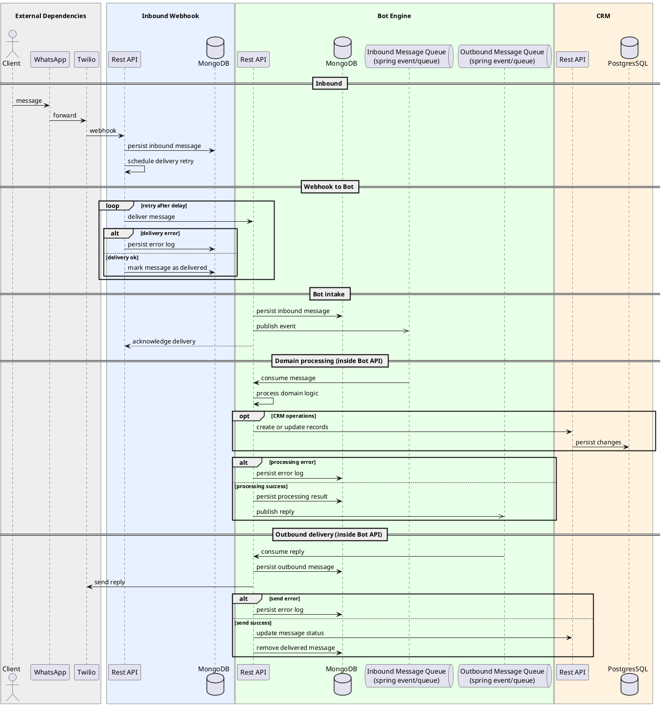

# Arquitetura

### Fluxo Principal

  
Código do diagrama

Você poderá editar o código abaixo no site [https://editor.plantuml.com](https://editor.plantuml.com).

```plantuml
@startuml

box "\nExternal Dependencies\n" #EEEEEE
  actor Client as client
  participant "WhatsApp" as whatsapp
  participant "Twilio" as twilio
end box

box "\nInbound Webhook\n" #E8F1FF
  participant "Rest API" as webhookApi
  database "MongoDB" as webhookDb
end box

box "\nBot Engine\n" #E8FFE8
  participant "Rest API" as botApi
  database "MongoDB" as botDb

  queue "Inbound Message Queue\n(spring event/queue)" as inboundQueue
  queue "Outbound Message Queue\n(spring event/queue)" as outboundQueue
end box

box "\nCRM\n" #FFF3E0
  participant "Rest API" as crmApi
  database "PostgresSQL" as crmDb
end box

== Inbound ==
client -> whatsapp : message
whatsapp -> twilio : forward
twilio -> webhookApi : webhook

webhookApi -> webhookDb : persist inbound message
webhookApi -> webhookApi : schedule delivery retry

== Webhook to Bot ==
loop retry after delay
  webhookApi -> botApi : deliver message
  alt delivery error
    webhookApi -> webhookDb : persist error log
  else delivery ok
    webhookApi -> webhookDb : mark message as delivered
  end
end

== Bot intake ==
botApi -> botDb : persist inbound message
botApi ->> inboundQueue : publish event
botApi --> webhookApi : acknowledge delivery

== Domain processing (inside Bot API) ==
botApi <- inboundQueue : consume message
botApi -> botApi : process domain logic
opt CRM operations
  botApi -> crmApi : create or update records
  crmApi -> crmDb : persist changes
end

alt processing error
  botApi -> botDb : persist error log
else processing success
  botApi -> botDb : persist processing result
  botApi ->> outboundQueue : publish reply
end

== Outbound delivery (inside Bot API) ==
botApi <- outboundQueue : consume reply
botApi -> botDb : persist outbound message
botApi -> twilio : send reply
alt send error
  botApi -> botDb : persist error log
else send success
  botApi -> crmApi : update message status
  botApi -> botDb : remove delivered message
end

@enduml
```

