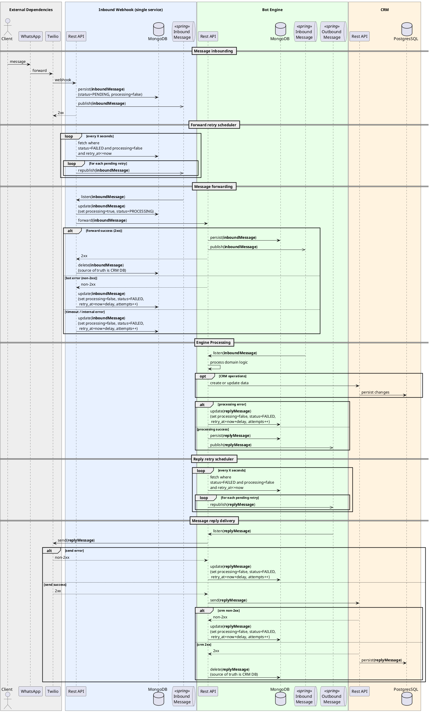

# Arquitetura

### Componentes
- **Webhook:** Serviço responsável por receber mensagens do WhatsApp via Twilio e persistir e encaminhar para o bot engine. Ele foi pensado para fazer apenas esta tarefa simples para reduzir riscos de falhas na entrada das mensagens no sistema.
- **Bot Engine:** Serviço principal que processa as mensagens recebidas, aplica a lógica de negócio, interage com o CRM e gera respostas.
- **CRM:** Sistema de gerenciamento de relacionamento com o cliente, utilizado para armazenar e gerenciar dados dos clientes e interações.

### Fluxo Principal
![Fluxo Principal](https://img.plantuml.biz/plantuml/svg/pLTTJnix47rVQV_3A7q90jJUUr-gAeaA95j5AfH2fVOXKkNT38brD_RMzXRuzntR-xt9GX_wmGl1S-mvS-QCJTvgmvJ9Toc4GHZ4yW56Ax5uCAW4Is6E6OerYeIZNeaHl5Yudp00O8cH2YvIZi80qv2uJpQIqO4yuHcZmEZpbXbzbcKZYxctVx0iww4-tVEKIuSnxcCOK5uWEWrMIn7Bd5O_OxoLydyOQousAO96zPqdUEG9lex-YQ9UWXlK1iwkbvw6F-0iunQtPeR5J2ECBgNOoFbv4pEFBUHRZZd5Im8hSObQimqw9FUh7nrcCj6P8bgpsRuApgM1XTXmWINNQF5wc6iipI1FYZ-38w6MXsXMMp_aPjzUMIm_fy2BcqjNMHH5_orU3LUMg5slickfpKQXlltuliJOwXg9fbCeo9N24ncOJiF06n1EPvNDu0tiF3OCgZMAUujHz4wgUwRMOL2isBsLDoXU_67pDjPhr3mcK8PASst6atXMC2e8Jbx6CpBbc2RCv7fwlRYQBw_UdK2cP488uZszOwd6eyxfixQbA4CUfrnl3sHexswMz-z3ALda2mM5HZs2JhQupbDKJhTKoWpmErBW2yrI8iLQswuShlWEJR8bbL6HZulgehFb-yKS67MgMzzAs5MN-YipawcGz_PybvSw0CZeD7lFs4uwc0rt2FH4KVYKB01qfZDFnpX5sqlZDF9CJhjfA8D1yIpfsoBb6TaQ1ro1fgcKKJcUG6cLcmyNYzjRSijHttl-HgZTUv1R6B3Kb2ZGUM9pmPXSuSGfpl4dFiF9hJsptfNoj4thxTqvSqOTSjmQKnmKK-OgGP1tG3gQBN0DT1N1_Dp9W6H2cnjGAVBRM4XnsbMXIwd03DFwoHwxQQYQx2VcP2MgqR2JSKobiiSJOCRWBZFw-BWkmV0TqcqCBycanGFjAlexIDPpvfyukAuETMDMA4qZrhVE4rFMighlJy4OrdB7kA3BPCCJcrvcnhLUafcPuLBejjVzgqC790f95Y0_U87SAsIn1S9ZctC1oPQ93UggL3jUjN9rB_gJLVU0hgtqyLTrm9gaGQWO-IU7lSUfC-hj_m1QWxvdQ-s36nlygJUdJ_CtlJK3rROUchrI7NXc7DPUNTmLsfw1RfPw0lQag6MftdPD-GwWlJ4jeBPa-GzESuGQLzoVScpXMSUruTPzR7jCgqaUb8A-g90OX6sMMm_v0Jt-d2Ba9gk89Jn8jXViNLS7xRglkFg1tLlSmFFQjlzR-arV9iFW1m00)

  
Código do diagrama

Você poderá editar o código abaixo no site [https://editor.plantuml.com](https://editor.plantuml.com).

