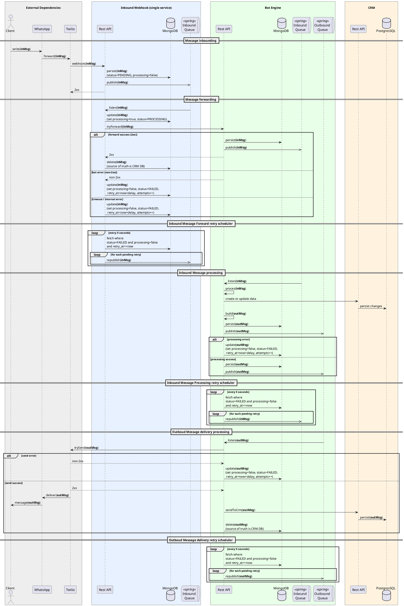

# Arquitetura

### Componentes
- **Webhook:** Serviço responsável por receber mensagens do WhatsApp via Twilio e persistir e encaminhar para o bot engine. Ele foi pensado para fazer apenas esta tarefa simples para reduzir riscos de falhas na entrada das mensagens no sistema.
- **Bot Engine:** Serviço principal que processa as mensagens recebidas, aplica a lógica de negócio, interage com o CRM e gera respostas.
- **CRM:** Sistema de gerenciamento de relacionamento com o cliente, utilizado para armazenar e gerenciar dados dos clientes e interações.

### Fluxo Principal
![Fluxo Principal](https://img.plantuml.biz/plantuml/svg/rLPDRziu4BqRy7yOU2yEag0VUoaAssWIMuM1fdMJ0js3WGKbJsoYCgabgJhvznsIaYNhomvGjDtu45kQuRnvV6_8TzemPT9j3FrUlwU_SP4mnRPmBHyNRBNYOWslNvPVB2YSHpnXmfG3x2UKZp1OYjcZGILO35DCKAnGH1prKWpWhvdxw_S0M6IaWfkOep30D4JkctsJ5El3uEk66NsL90CRixC_M9BKehxiUCobYp7kQxz7TO7Wb53DHIXJUleLmusKts2e2NgCe55zvn6UUO1lWbT1K2jmXzh0rMBkOVW5hX9kurRCi91fXC6j56ivlIx7J4CRyb-AARtF0Ip5P_l0nN7_p3s0qKWdYa1D9atuhwM1cLXpWJdIOFQc6saeJITAUdyK8SNCsq3k4p-bffufiuUdD7TpT-kw2eBWxzdBxguYjQrrjP3Qh1Ng-yyVyXZRMQdGU0otg3LROqwwLUvutEzvwS7bP2ymU0ixnGqEH-4a2yvoHo_2oLc_jm-a9AyuIdcGQiVKgZKf2xHrzWgobVoFrZIgLeGNoTEGSXDKcclJahiKGpAtIVLuCViudNzyVm69aX55KElZ1nPhFAkiFZbK95L8mvZhJJiJfUmo6QyVgwndzEIibn97bzMgLDAWEAde8I5fGffespVB1veo1qQbU04vINUVRcRtzyHJ0-lUIbJ1gAVWo4RtUomsUR-WqyYMWo5HScPLcotb5prX6mzo9ZL37j-Z8hsgFRTB0EryhZ36JZvbgY84-K2yf6O3N0DP6QRNZWOaXTdQW4hHj1yAAIwhB5GXPJ7Ti9wvpKxg-tqEhkOVPjEBfG25j9l_CZCMSdTEhRAd2s36u3On-loyQC7mBT8qWnUaq-neSntz6I1fo6LMo-TtRhbCg7u9qD46LscColalbZ81_8xquXyw0oCfLhgxdmSqqOPc92ewWGvW0gEYrLQMmZxDqOyiVBk-gqlU06IqchqVs8dWmkph2e3QF59uNEsEa7PM2g2EY4o8D8JgpZeoXmwSxENh5pyXmvzYb14f99a0CU85uqurEfNyUnzPdX8GRPXOezkiHWXXocCtd8Yh-Aa3SNNsTCLFAiVvmTHfIFGpi4JrtZ1r28LHQWlzJ9jO9vS0PNFvw4HkQEvW7Z-FbtPPBWfep_5h7VilycddaNJCfj3WKt-9B0YXJUIktrR3LgalxDef_VqbXNgvf_gD2P1hMDjBv5wz-IMkRBZIaVMxn9t9ss4j2Ri9ROQqT1ijRhqPvQsoBzzxislpMzZweEDUAMQUnVb5tgXj6_LE7wqZy8HIEVt51QQH_exhomd2_B_vjEgN0vSs4bgsw3lwdsxZVky7)

  
Código do diagrama

Você poderá editar o código abaixo no site [https://editor.plantuml.com](https://editor.plantuml.com).

### Legenda do Diagrama

- **inMsg** — mensagem de entrada (*inbound message*).
- **outMsg** — mensagem de saída (*outbound message*).
- **PENDING** — registrada e aguardando processamento.
- **PROCESSING** — em processamento ativo.
- **FAILED** — falha ocorrida; elegível para retry.
- **processing=false** — mensagem livre para reprocessamento.
- **retry_at** — instante mínimo para nova tentativa.
- **attempts** — contador de tentativas realizadas.
- **publish / republish** — envio inicial / reenvio para fila.
- **2xx / non-2xx** — resposta de sucesso / erro HTTP.
- **source of truth** — banco responsável pelo dado final.

